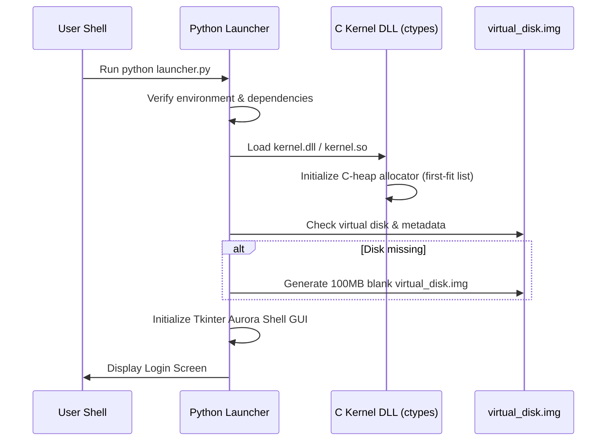

# 🚀 AuroraOS Quick Start Guide

Get up and running with AuroraOS in 5 minutes!

## ⚡ Quick Installation

### Step 1: Verify Python

```bash
python --version
```

**Required:** Python 3.8 or higher

### Step 2: Navigate to AuroraOS

```bash
cd "c:\Users\ANSARI MOHAMMED\OneDrive\Desktop\Software\AuroraOS"
```

### Step 3: Launch AuroraOS

```bash
python launcher.py
```

That's it! 🎉

---

## 🔑 Default Login

When the login screen appears:

- **Username:** `aurora`
- **Password:** `admin123`

Click **Sign In** or press Enter.

---

## 🎯 First Steps

After logging in, you'll see the Aurora Shell desktop. Try these:

### 1️⃣ Open Terminal

- Click **⚡ Start** → **⌨️ Terminal**
- Or click the Terminal icon in the taskbar

Try some commands:
```bash
ls                  # List files
pwd                 # Show current directory
cat welcome.txt     # Read welcome file
help               # Show all commands
```

### 2️⃣ Explore Files

- Click **⚡ Start** → **📁 File Manager**
- Browse your files
- Create new folders
- Double-click files to view content

### 3️⃣ Edit a Text File

- Click **⚡ Start** → **📝 Text Editor**
- Click **Open** and enter: `/home/aurora/welcome.txt`
- Edit the file
- Click **Save**

### 4️⃣ Check System Settings

- Click **⚡ Start** → **⚙️ Settings**
- Explore different sections:
  - **👤 User Account** - Your user info
  - **🎨 Appearance** - Aurora theme colors
  - **🖥️ System Info** - OS details
  - **ℹ️ About** - About AuroraOS

---

## 🎨 Beautiful Aurora Theme

AuroraOS features a **northern lights-inspired** color scheme:

- **🌌 Deep Black** background (#0A0E27)
- **💠 Teal** accents (#00D9FF)
- **💜 Purple** highlights (#9D4EDD)
- **✨ Neon Blue** (#5E60CE)

Enjoy the glowing, futuristic design!

---

## 📋 Useful Terminal Commands

```bash
# File operations
ls                      # List directory
cd Documents            # Change to Documents folder
cd ..                   # Go up one level
mkdir my_folder         # Create folder
touch my_file.txt       # Create file
cat my_file.txt         # View file
rm my_file.txt          # Delete file

# System info
whoami                  # Show current user
date                    # Show date/time
sysinfo                 # System information
uptime                  # System uptime

# Help & cleanup
help                    # Show all commands
clear                   # Clear screen
exit                    # Close terminal
```

---

## 🎮 Keyboard Shortcuts

### Aurora Shell
- `F11` - Toggle fullscreen (if supported)
- `Alt+F4` - Close window

### Terminal
- `↑/↓` - Navigate command history
- `Enter` - Execute command
- `Ctrl+C` - Cancel input

### Text Editor
- `Ctrl+N` - New file
- `Ctrl+O` - Open file
- `Ctrl+S` - Save file
- `Ctrl+X` - Cut
- `Ctrl+C` - Copy
- `Ctrl+V` - Paste
- `Ctrl+A` - Select all

---

## 🛠️ Troubleshooting

### Problem: "tkinter not found"

**Solution:**
```bash
# On Windows: Reinstall Python with tkinter
# On Linux:
sudo apt-get install python3-tk
```

### Problem: Can't see login screen

**Solution:**
- Check console for errors
- Verify Python version is 3.8+
- Ensure you're in the correct directory

### Problem: Files not saving

**Solution:**
- Check disk space in File Manager
- Ensure you have permissions
- Try restarting AuroraOS

---

## 📚 Learn More

- **Full User Guide:** `docs/USER_GUIDE.md`
- **Developer Guide:** `docs/DEVELOPER_GUIDE.md`
- **Architecture:** `docs/architecture/OVERVIEW.md`

---

## 🌟 Cool Things to Try

1. **Create a project folder:**
   ```bash
   mkdir ~/my_project
   cd ~/my_project
   touch README.md
   ```

2. **Write a text file:**
   - Open Text Editor
   - Write something
   - Save to `/home/aurora/notes.txt`

3. **Explore the file system:**
   ```bash
   ls /
   cd /home
   ls -l
   ```

4. **Check who you are:**
   ```bash
   whoami
   sysinfo
   ```

5. **Create your own file structure:**
   ```bash
   mkdir -p ~/Documents/Projects/AuroraOS
   cd ~/Documents/Projects/AuroraOS
   touch ideas.txt
   ```

---

## 💡 Tips

- **Save frequently** in Text Editor
- **Use Terminal** for faster file operations
- **Explore Settings** to learn about the system
- **Check System Info** to see specifications
- **Files persist** between sessions!

---

## 🚪 Exit AuroraOS

1. Click **⚡ Start** → **⚠️ Shutdown**
2. Confirm shutdown
3. All your files are automatically saved!

---

## 🎓 Educational Purpose

AuroraOS is built for learning:

- **Understand OS concepts** (processes, memory, files)
- **Learn Python** and GUI programming
- **Explore system architecture**
- **Experiment safely** in a virtual environment

Perfect for:
- Computer Science students
- OS enthusiasts
- Anyone curious about how operating systems work!

---

## ❓ Need Help?

- Read the full **USER_GUIDE.md**
- Check **DEVELOPER_GUIDE.md** for technical details
- Review **architecture/OVERVIEW.md** for system design

---

**Enjoy AuroraOS! 🌌**

*Where education meets beautiful design*

---

## 🎯 Next Steps

After getting comfortable with AuroraOS:

1. **Explore the code** in `kernel/`, `system/`, `apps/`
2. **Modify the theme** in `ui/shell/aurora_shell.py`
3. **Add custom commands** to Terminal
4. **Build your own app** following the Developer Guide
5. **Contribute** improvements to the project!

**Happy exploring!** ✨


---

## 🎓 Systems Science: The Boot Sequence Explained

For students learning system architecture, here is exactly what happens when you launch AuroraOS:

### 1. Booting the Hybrid Environment (Python & C DLL)


### 2. Booting the Bare-Metal OS (x86 QEMU)
When you execute `make run-baremetal`:
1. **BIOS**: The system firmware performs Power-On Self-Test (POST) and loads the Multiboot bootloader (QEMU acts as the BIOS).
2. **Multiboot Entry**: The bootloader locates the multiboot header in `bare_metal/boot/boot.asm` and hands control to our assembly routine.
3. **Protected Mode**: The assembly code sets up a temporary boot stack, disables CPU paging, and sets segment registers to 32-bit Flat Mode.
4. **C Kernel Transition**: Assembly calls `kernel_main()` inside `bare_metal/kernel/kernel.c`.
5. **Driver Initialization**: The kernel registers GDT, IDT (Interrupt Descriptor Table) vectors, PIC interrupts, mouse/keyboard handler ports, and switches VGA memory to 320x200 256-color graphics mode (`Mode 13h`).
