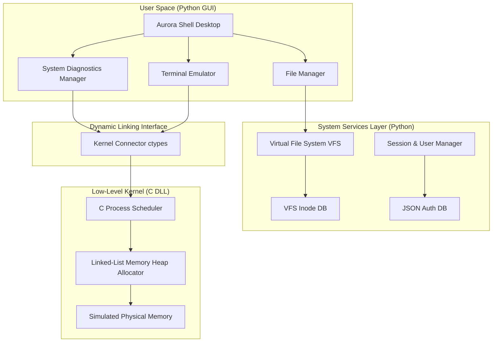
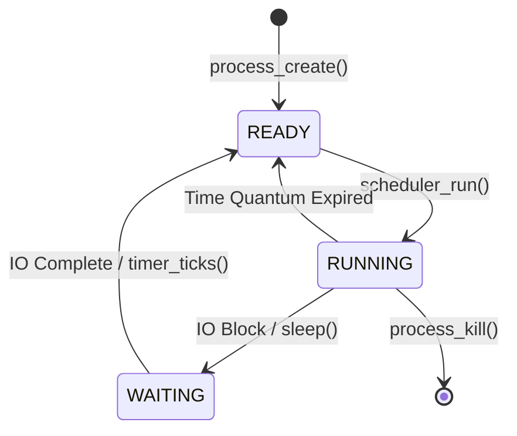

# 🌌 AuroraOS - The Ultimate Master Specification

Welcome to the **Master Documentation Specification** for **AuroraOS**—a comprehensive, dual-architecture educational operating system combining low-level C and Assembly kernel development with high-level Python dynamic services and visual simulation.

---

## 📖 Master Table of Contents
1. [🎯 High-Level Architectural Overview](#1-high-level-architectural-overview)
2. [💼 Executive Summary & Project Metrics](#2-executive-summary--project-metrics)
3. [📘 Comprehensive Systems Programming Thesis: Language Choice & Design Trade-offs](#3-comprehensive-systems-programming-thesis-language-choice--design-trade-offs)
4. [⚡ Quick Start & Setup Guide (5-Minute Launch)](#4-quick-start--setup-guide-5-minute-launch)
5. [🎉 Complete Usage Tour & Interactive App Specs](#5-complete-usage-tour--interactive-app-specs)
6. [📖 Operating System Theory for everyday users](#6-operating-system-theory-for-everyday-users)
7. [🏗️ Component Details & Kernel Layer Internals](#7-component-details--kernel-layer-internals)
8. [📈 Space/Time Complexity & Process State Models](#8-spacetime-complexity--process-state-models)
9. [🖥️ Bare-Metal x86 Bootloader & Kernel Architecture](#9-bare-metal-x86-bootloader-and-kernel-architecture)
10. [📂 Directory Layout & Source Tree Map](#10-directory-layout--source-tree-map)
11. [🔧 Detailed Developer setup & Extension API Guidelines](#11-detailed-developer-setup--extension-api-guidelines)
12. [📋 Roadmap & License Terms](#12-roadmap--license-terms)

---

## 1. 🎯 High-Level Architectural Overview

AuroraOS operates as a **hybrid system** to demonstrate both low-level OS design and modern desktop application layer interactions:



---

## 2. 💼 Executive Summary & Project Metrics

### Primary Goals
- **Educational Value**: Demonstrates memory allocations, scheduler queues, and block storage devices.
- **Visual Diagnostics**: Real-time canvas rendering of the dynamic heap states and processes.
- **Bare-Metal Booting**: Boots directly into x86 32-bit Protected Mode inside QEMU with a retro custom GUI.

### Project Metrics
- **Total Code**: ~5,500+ lines
- **Languages**: Assembly (x86), C, Python, Markdown
- **Components**: C Kernel, Python Dynamic Linker, VFS Disk, Desktop GUI shell, 4 core GUI apps.

---

## 3. 📘 Comprehensive Systems Programming Thesis: Language Choice & Design Trade-offs

### 1. Choice of Assembly (NASM / x86 Assembly)
* **Where It Is Used**: Setting up the bootloader (`boot.asm`), GDT/IDT descriptors initialization, interrupt handler routing, and executing context switches.
* **Why High-Level Languages Fail Here**: High-level compilers (like C or Rust) generate instructions assuming an already-initialized execution environment (stack pointer set, segment registers configured, interrupts masked). Assembly is required to:
  * Interact directly with CPU registers (`eax`, `ebx`, `cr0`, `cr3`, etc.).
  * Direct-load descriptor tables using specific hardware instructions (`lgdt`, `lidt`).
  * Issue port-level input/output operations (`inb`, `outb`) to speak directly to the PIC (Programmable Interrupt Controller) and PIT (Programmable Interval Timer).
  * Safely transition the CPU from 16-bit Real Mode (or 32-bit Multiboot stage) to 32-bit Protected Mode.
* **Alternative Considered**: Inline assembly inside C. However, using a standalone assembler (NASM) enforces a clean physical separation between CPU initialization and logical kernel flows, improving readability.

### 2. Choice of C (MinGW GCC / Standard C)
* **Where It Is Used**: Low-level process scheduler, the First-Fit heap allocator, memory structures (`pcb_t`, `memory_block_t`), and VGA hardware drivers.
* **Why C is the De Facto Choice for Kernels**:
  * **Zero Runtime & Freestanding Execution**: Unlike languages like Java or Go, C compiled code runs directly on the CPU metal. It has no garbage collector, virtual machine, or mandatory startup runtime to load.
  * **Explicit Pointer Arithmetic**: OS developers must access absolute, hardcoded physical memory addresses (e.g., VGA buffer at `0xB8000` or memory-mapped registers). C allows direct dereferencing of raw numeric addresses to structured pointers: `(uint16_t*)0xB8000`.
  * **Deterministic Memory Layout**: Using `__attribute__((packed))` guarantees that structs occupy exact bit alignments matching physical hardware registers or binary network packets, avoiding padding compiler differences.
* **Why not C++?**
  * C++ introduces features like Run-Time Type Information (RTTI), exceptions, and classes. In a freestanding (no OS) environment, exceptions require a complex unwinding runtime library, and memory-allocator-dependent classes cause crashes unless `new` and `delete` operators are manually overridden. C's simplicity prevents hidden code paths.
* **Why not Rust?**
  * While Rust provides memory safety and concurrency guarantees, its compiler rules (the borrow checker) make low-level systems programming highly verbose. Operating system development inherently involves writing "unsafe" code because you must manipulate raw memory and physical pointers. Writing a kernel in Rust forces developers to wrap almost all logic in `unsafe {}` blocks, negating many of its safety benefits while introducing a steep learning curve for students learning OS concepts for the first time.

### 3. Choice of Python (Python 3.14 / Tkinter)
* **Where It Is Used**: The graphical Aurora desktop shell, virtual file system block manager, authentication system, and the live system dashboard simulator.
* **Why Python is Ideal for the Simulation Layer**:
  * **Rapid GUI Prototyping**: Creating pixel-perfect GUI controls, menus, and visual canvas tools in C requires thousands of lines of verbose, platform-specific code (e.g., Win32 API or X11). Python's `tkinter` standard library provides an instant, cross-platform UI framework with standard loops.
  * **Standard Library Strengths**: Implementing robust security models (SHA-256) or serialization (JSON config database files) in C is highly prone to buffer overflows and memory leaks. Python provides high-level hashing (`hashlib`) and string parsing out of the box.
  * **Binary Binding with `ctypes`**: Python's foreign function interface (`ctypes`) bridges the gap seamlessly. It allows Python to load a compiled native C dynamic library (`kernel.dll`/`kernel.so`) and read its structures, providing the performance of C with the ease-of-use of Python.

---

## 4. ⚡ Quick Start & Setup Guide (5-Minute Launch)

### Prerequisites
* **Python 3.8+**
* **GCC Compiler** (MinGW for Windows, standard GCC for Linux)
* **NASM** (Required for bare-metal Assembly assembly)
* **QEMU** (Required for bare-metal emulation)

### Setup & Run (GUI Simulator)

1. Open your terminal in the `AuroraOS` directory.
2. Run the system using the root Makefile:
   ```bash
   make run
   ```
   *Note: This command automatically detects your OS, compiles the dynamic C library (`kernel.dll` / `kernel.so`), configures UTF-8 encoding streams, creates the 100MB virtual disk if missing, and boots the launcher GUI.*

3. Log in using the default credentials:
   * **Username**: `aurora` | **Password**: `admin123` (Administrator)
   * **Username**: `guest`  | **Password**: `guest` (Standard User)

---

## 5. 🎉 Complete Usage Tour & Interactive App Specs

### 1. Aurora Desktop Shell
* **Theme**: Northern lights inspired dark theme.
* **Layout**: Complete taskbar, quick launch, Start menu, system clock, and desktop icons (Files, Recycle Bin).

### 2. Built-in Applications
* **Terminal Emulator**: Supports file commands (`ls`, `cd`, `pwd`, `mkdir`, `touch`, `cat`, `rm`), system info commands (`whoami`, `sysinfo`, `uptime`), and standard shell shortcuts (Up/Down arrow history, Tab auto-completion, `Ctrl+C` interrupt).
* **Text Editor**: A rich editing app that supports saving/loading directly to VFS data blocks, dynamic cut/copy/paste, and undo/redo states.
* **File Manager**: Supports directory traversal, file deletion without shell crashes, directory creation, and direct Text Editor loading when a file is double-clicked.
* **Settings Panel**: User profile inspector, password modification utility, theme selector, and system resource specifications.
* **System Monitor**: Tabbed dashboards showing CPU/RAM utilization, process scheduler queues (kill/spawn mechanisms), and canvas-based block visualizer displaying allocation splits and pointer merges.

---

## 6. 📖 Operating System Theory for Everyday Users

Operating systems seem magical, but they follow strict deterministic logic. Here is how your actions translate to under-the-hood events:

### 1. When you Create a File in File Manager
1. **User Request**: You click "New File" and enter `notes.txt`.
2. **System Service Call**: The File Manager app makes a call to the Virtual File System (VFS): `vfs.create_file("/home/aurora/notes.txt")`.
3. **Inode Allocation**: The VFS finds an unused Inode slot, registers `notes.txt` as a child of `/home/aurora/`, and sets the size to `0`.
4. **Disk Write**: VFS writes the updated Inode structure to `virtual_disk.img` and updates `filesystem_metadata.json`.
5. **UI Update**: The File Manager refreshes, reading the Inode table to show the new icon.

### 2. When you Delete a Folder
1. **Recursion**: The VFS checks if the folder contains files.
2. **Block Deallocation**: If files exist, the VFS marks all data blocks associated with those files as "free" in the Superblock bitmap.
3. **Inode Clearing**: The Inode entries for the files and the folder itself are wiped clean.
4. **No Crash Safety**: In older versions, deleting closed the application due to standard stream errors. Now, the File Manager updates live and stays open safely.

---

## 7. 🏗️ Component Details & Kernel Layer Internals

The low-level C Kernel core handles dynamic memory allocations and processes scheduling.

### 1. Memory Management: First-Fit Linked List Heap Allocator
The dynamic memory allocator inside the C kernel (`kernel/src/memory.c`) manages a contiguous block of simulated physical RAM. It utilizes a **linked-list allocation strategy**.

#### The Block Structure:
Each block of memory is preceded by a metadata header:
```c
typedef struct memory_block {
    size_t size;             // Size of the payload in bytes
    bool is_free;            // Allocation state flag
    struct memory_block *next; // Pointer to next block in list
    struct memory_block *prev; // Pointer to previous block in list
} memory_block_t;
```

#### Algorithms Utilized:
1. **First-Fit Search**:
   When `kmalloc(size)` is called, the allocator traverses the linked list from the beginning (`head`) and selects the *first* block that is free and has `size >= requested_size`.
   * **Why First-Fit?** It has a temporal complexity of $O(N)$ but is extremely simple to implement and tends to cluster allocations at the beginning of the memory space, leaving larger free blocks at the end.
   * **Comparison with Best-Fit**: Best-fit searches the entire list to find the block closest in size, reducing internal fragmentation but taking a guaranteed $O(N)$ time. Worst-fit chooses the largest block to leave a large remainder.

2. **Block Splitting**:
   If the selected block is significantly larger than the requested size (header size + payload size), it is split into two blocks:
   * Block A: Marked as allocated, size set to requested size.
   * Block B: Inserted into the linked list immediately after Block A, marked as free, size set to the remaining bytes.

3. **Coalescing**:
   When `kfree(ptr)` is called, the allocator marks the target block as free. To prevent fragmentation, it checks the adjacent blocks:
   * If `block->next` is free, merge Block and `block->next` into a single block.
   * If `block->prev` is free, merge `block->prev` and Block into a single block.
   * This ensures that consecutive free blocks are always unified, maintaining maximum contiguous memory availability.

### 2. Process Scheduler: Round-Robin Queue
The task manager scheduler simulates a primitive multitasking OS environment.
* **Process Control Block (PCB)**: Stores PID, Name, Priority, Program Counter (simulated), Execution State (READY, RUNNING, WAITING), and CPU Tick count.
* **Round-Robin Scheduling**: The scheduler runs at periodic intervals. It picks the next process in the queue that is in the `READY` state, assigns it a quantum (ticks), sets its state to `RUNNING`, executes it, and then places it back at the end of the queue, ensuring equal CPU allocation.
* **Kill Safeguards**: Processes with `PID < 3` (`init` and `kthreadd`) are marked as kernel-critical. Any attempt to kill them throws an OS access violation error to prevent system instability.

### 3. FAT-like Virtual File System (VFS) Layout
The file system stores directories and files in a single flat file called `virtual_disk.img` (100MB). It virtualizes storage using block addressing:

| Section | Size | Purpose |
|---------|------|---------|
| **Superblock** | Block 0 | Stores filesystem metadata (disk size, block size, inode count, free block bitmap) |
| **Inode Table** | Blocks 1 - 100 | Stores structures containing file names, file sizes, creation timestamps, parent directory ID, and pointers to data blocks |
| **Data Blocks** | Blocks 101 - End | 4096-byte blocks storing raw file contents |

#### Allocation Mechanics:
When a file is modified:
1. The filesystem splits the content into 4KB data blocks.
2. It looks up the Free Block Bitmap in the Superblock to find available data block indices.
3. It updates the file's Inode to point to these data blocks.
4. The metadata index file (`filesystem_metadata.json`) keeps a fast lookup table of active directory nodes for GUI speed, which is synchronized on shutdown.

### 4. Binary Alignment and Dynamic Binding via `ctypes`
Dynamic binding requires matching the structure alignment rules of the host OS and C compiler.

#### Alignment Rules:
On a 32-bit system (or 32-bit compiler target):
* `uint32_t` is aligned to a 4-byte boundary.
* A structure containing three `uint32_t` fields is exactly 12 bytes.

In Python:
```python
class HeapBlockInfo(ctypes.Structure):
    _fields_ = [
        ("address", ctypes.c_uint32),
        ("size", ctypes.c_uint32),
        ("is_free", ctypes.c_uint32),
    ]
```
Python's `ctypes` module calculates structural offsets automatically. If there is a mismatch (e.g. compiling the DLL as 32-bit but running Python as 64-bit), the alignment shifts. AuroraOS handles this mismatch by:
1. Catching dynamic linking load failures.
2. Gracefully falling back to a pure Python emulation kernel that matches the linked-list heap math.

---

## 8. 📈 Space/Time Complexity & Process State Models

### 1. Space and Time Complexity Analysis
* **First-Fit Memory Allocator**:
  * **Allocation (`kmalloc`)**: Time complexity is $O(N)$ where $N$ is the number of allocated/free blocks in the list. Space complexity is $O(1)$ auxiliary, with $O(M)$ overhead where $M$ is the number of headers (each header takes 16 bytes on 32-bit systems).
  * **Deallocation (`kfree`)**: Time complexity is $O(1)$ because we have double-linked list pointers (`next` and `prev`) allowing instant updates and coalescence.
* **Process Scheduler**:
  * **Round-Robin Scheduling**: $O(1)$ to dequeue the next process and run it. $O(P)$ to insert back or check states where $P$ is the active process count.

### 2. State Transition Model of a Process


---

## 9. 🖥️ Bare-Metal x86 Bootloader and Kernel Architecture

The real 32-bit x86 Operating System kernel is located in the `bare_metal/` folder and compiles into a bootable ISO.

### 1. Intel x86 Protected Mode Details

#### Global Descriptor Table (GDT)
The GDT defines the memory segments (Privilege levels or Rings). We set up 5 descriptors:
1. **Null Descriptor**: Required by the CPU.
2. **Kernel Code Segment**: Base `0x0`, Limit `0xFFFFFFFF`, Ring 0 (highest privilege), Executable/Read.
3. **Kernel Data Segment**: Base `0x0`, Limit `0xFFFFFFFF`, Ring 0, Read/Write.
4. **User Code Segment**: Base `0x0`, Limit `0xFFFFFFFF`, Ring 3 (user space applications), Executable/Read.
5. **User Data Segment**: Base `0x0`, Limit `0xFFFFFFFF`, Ring 3, Read/Write.

#### Interrupt Descriptor Table (IDT) & PIC
The IDT routes hardware interrupts (IRQs) and software exceptions to ISR routines.
* **PIC Remapping**: The standard Intel 8259 Programmable Interrupt Controller (PIC) maps hardware interrupts to vector slots 0-7. However, these conflict with default CPU exceptions. We remap the Master PIC to use vectors `0x20 - 0x27` and the Slave PIC to `0x28 - 0x2F`.
* **Keyboard Interrupt (IRQ 1)**: Tied to Interrupt vector `0x21`. When a key is pressed, the CPU halts execution, saves registers, calls the keyboard handler in `vga.c`/`kernel.c`, reads the scancode from port `0x60`, and sends an EOI (End of Interrupt) signal to the PIC (`outb(0x20, 0x20)`).

#### VGA Graphics: Mode 13h
The bare-metal graphics driver writes directly to memory address `0xA0000`. By setting VGA controller registers to Mode 13h, we get:
* **Resolution**: 320x200 pixels.
* **Colors**: 256 colors using an 8-bit lookup palette.
* **Plotting a Pixel**: Writing a color byte to index `0xA0000 + (y * 320) + x` paints that pixel instantly.

### 2. Assembly Bootstrap & Linker Internals

#### Linker Script (`linker.ld`)
The linker script is crucial for x86 bootable OS binaries. It specifies the exact order of section placing:
* **`ENTRY(_start)`**: Sets the binary entry point to the `_start` label in `boot.asm`.
* **`. = 1M` (1 Megabyte)**: The kernel is loaded at physical memory address `1MB`. Memory below 1MB is reserved for BIOS variables, VGA graphics buffer, and legacy hardware.
* **`.multiboot`**: Places the multiboot header at the very beginning of the binary, satisfying the GRUB loader specification.

#### Multiboot Header Structure
The multiboot header consists of:
* **Magic Number**: `0x1BADB002` (expected by GRUB/QEMU).
* **Flags**: Specifies if the kernel requires page alignment or memory information.
* **Checksum**: Must satisfy `(magic + flags + checksum) == 0`.

### 3. How to Build & Run Baremetal inside QEMU

1. **Install NASM and QEMU**:
   * **Windows** (via Chocolatey): `choco install nasm qemu`
   * **Windows** (via Winget): `winget install NASM.NASM SoftwareCollab.QEMU`
   * **Linux/Debian**: `sudo apt install nasm qemu-system-x86 build-essential`

2. **Compile and Run**:
   ```bash
   make baremetal
   make run-baremetal
   ```
   This will assemble `boot.asm` and compile the bare-metal C files, link them into `bare_metal/myos.bin`, and run QEMU simulating mouse crosshairs and keyboard interrupts.

---

## 10. 📂 Directory Layout & Source Tree Map

```
AuroraOS/
├── apps/                   # Built-in Desktop Applications
│   ├── calculator/         # Standard Calculator GUI app
│   ├── editor/             # Text Editor app with VFS save/load
│   ├── filemanager/        # Graphical directory/file browser
│   ├── settings/           # Customizer for user data and themes
│   └── sysmonitor/         # Diagnostics, Task Manager, & Heap Visualizer
│   └── terminal/           # Shell emulator with command routing
├── bare_metal/             # Bootable x86 C/Assembly OS Kernel
│   ├── boot/               # boot.asm Multiboot x86 entry point
│   ├── arch/               # GDT, IDT, ISR descriptors and loader scripts
│   ├── drivers/            # VGA graphics, keyboard, and PS/2 mouse drivers
│   ├── kernel/             # Bare-metal kernel entry point
│   └── libc/               # Standard library overrides (string, stdio)
├── config/                 # System Registry and User DB
│   ├── system/             # VFS virtual_disk.img and metadata
│   └── user/               # Persistent users and sessions data
├── docs/                   # Developer guides & API references
├── drivers/                # Simulated storage and display drivers
├── kernel/                 # Shared C Kernel library code (ctypes target)
│   ├── include/            # C headers (kernel.h, memory.h)
│   └── src/                # C implementation (kernel.c, memory.c)
├── system/                 # System services
│   └── core/               # File system (VFS) and C-Kernel Connector
├── ui/                     # Tkinter graphics components
│   ├── shell/              # Desktop environment, Start Menu, & Taskbar
│   └── themes/             # Color tokens, styles, and asset catalogs
├── user/                   # User Profile and Session Management
├── launcher.py             # Main GUI OS startup script
├── Makefile                # Root builder automating C DLL and bare-metal compilation
└── requirements.txt        # Python external dependency declarations
```

---

## 11. 🔧 Detailed Developer Setup & Extension API Guidelines

### 1. Writing a New Custom C-Kernel Function
To add a new routine to the C Kernel:
1. Open [kernel/include/kernel.h](file:///c:/Users/ANSARI%20MOHAMMED/OneDrive/Desktop/Software/AuroraOS/kernel/include/kernel.h) or the appropriate header and declare your function:
   ```c
   __declspec(dllexport) int get_system_uptime_ticks(void);
   ```
2. Implement your function in the source file:
   ```c
   int get_system_uptime_ticks(void) {
       return scheduler_ticks; // Global tick counter
   }
   ```
3. Recompile the library using the Makefile:
   ```bash
   make clean && make
   ```
4. Bind the function in the Python connector [system/core/kernel_connector.py](file:///c:/Users/ANSARI%20MOHAMMED/OneDrive/Desktop/Software/AuroraOS/system/core/kernel_connector.py):
   ```python
   self.lib.get_system_uptime_ticks.argtypes = []
   self.lib.get_system_uptime_ticks.restype = ctypes.c_int
   ```
5. Implement the simulation fallback inside `PythonKernelSimulator` to prevent crashes when the C library is compiled as a mismatch.

### 2. Debugging Memory Violations
If a memory violation occurs (segmentation fault) in the DLL, Windows will terminate the Python process instantly. To debug this:
* Compile with debugging symbols enabled by adding `-g` to the compiler flags in the [Makefile](file:///c:/Users/ANSARI%20MOHAMMED/OneDrive/Desktop/Software/AuroraOS/Makefile).
* Run the Python script using a native debugger like GDB:
  ```bash
  gdb --args python launcher.py
  ```

---

## 12. 📋 Roadmap & License Terms

- [x] Consolidate project files into a unified structure.
- [x] Link C kernel memory/processes dynamically to Python Tkinter.
- [x] Implement the interactive VFS block filesystem.
- [x] Create the System Diagnostics Task Manager.
- [x] Add the graphical C-Heap Allocator block visualizer.
- [x] Create root Makefiles to build both the GUI and the bare-metal kernel.
- [x] Create standardized `.gitignore` rules for local caching, bytecode, and virtual disks.
- [ ] Add virtual network socket simulations.
- [ ] Implement write-back file caching to VFS blocks.

### License
This project is licensed under the MIT License and is meant for educational and systems programming research.
