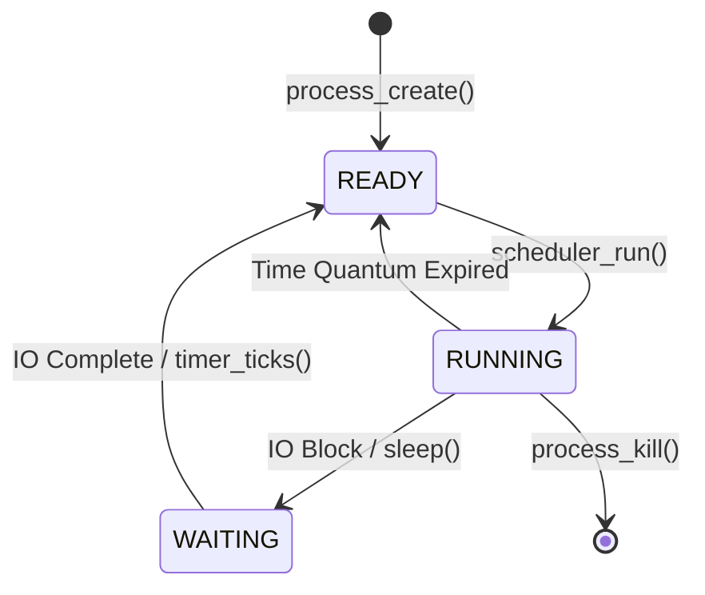

# AuroraOS Architecture Overview

Complete architectural documentation for AuroraOS.

## 🏗️ System Architecture

### High-Level Overview

```
┌─────────────────────────────────────────────────────────────┐
│                     USER APPLICATIONS                       │
│  ┌─────────┐  ┌──────────┐  ┌────────┐  ┌──────────┐      │
│  │Terminal │  │Text Editor│  │File Mgr│  │ Settings │      │
│  └─────────┘  └──────────┘  └────────┘  └──────────┘      │
└─────────────────────────────────────────────────────────────┘
                            ▲
                            │
┌─────────────────────────────────────────────────────────────┐
│                    AURORA SHELL (GUI)                       │
│  ┌──────────┐  ┌────────┐  ┌─────────┐  ┌─────────┐       │
│  │ Desktop  │  │Taskbar │  │Start Menu│  │ Windows │       │
│  └──────────┘  └────────┘  └─────────┘  └─────────┘       │
└─────────────────────────────────────────────────────────────┘
                            ▲
                            │
┌─────────────────────────────────────────────────────────────┐
│                   SYSTEM SERVICES (Python)                  │
│  ┌──────────┐  ┌─────────┐  ┌─────────┐  ┌──────────┐     │
│  │File System│  │Auth Mgr │  │Session  │  │ Network  │     │
│  └──────────┘  └─────────┘  └─────────┘  └──────────┘     │
└─────────────────────────────────────────────────────────────┘
                            ▲
                            │
┌─────────────────────────────────────────────────────────────┐
│                    KERNEL LAYER (C/Python)                  │
│  ┌─────────┐  ┌──────────┐  ┌──────────┐  ┌──────────┐    │
│  │ Memory  │  │ Process  │  │Interrupt │  │ Syscalls │    │
│  └─────────┘  └──────────┘  └──────────┘  └──────────┘    │
└─────────────────────────────────────────────────────────────┘
                            ▲
                            │
┌─────────────────────────────────────────────────────────────┐
│              HARDWARE ABSTRACTION LAYER (Simulated)         │
│  ┌─────────┐  ┌──────────┐  ┌──────────┐  ┌──────────┐    │
│  │ Display │  │   Disk   │  │ Network  │  │   CPU    │    │
│  └─────────┘  └──────────┘  └──────────┘  └──────────┘    │
└─────────────────────────────────────────────────────────────┘
```

---

## 🔧 Component Details

### 1. Kernel Layer

**Purpose:** Low-level system operations and resource management

**Technology:** C (simulated in Python for educational purposes)

**Components:**

#### Memory Management
```c
// Handles memory allocation and deallocation
void* kmalloc(size_t size);
void kfree(void* ptr);

// Memory blocks managed via linked list
typedef struct memory_block {
    size_t size;
    bool is_free;
    struct memory_block *next;
    struct memory_block *prev;
} memory_block_t;
```

**Responsibilities:**
- Dynamic memory allocation
- Memory coalescing (combining free blocks)
- Tracking memory usage
- Preventing memory leaks

#### Process Management
```c
// Process control block
typedef struct process_control_block {
    uint32_t pid;
    process_state_t state;
    uint32_t priority;
    char name[64];
    // ... more fields
} pcb_t;

// Process operations
int32_t process_create(const char *name, void (*entry_point)(void), uint32_t priority);
int32_t process_kill(uint32_t pid);
void scheduler_run(void);
```

**Scheduler:** Round-robin scheduling algorithm

#### Interrupt Handling
```c
typedef void (*interrupt_handler_t)(registers_t*);

void interrupts_init(void);
void interrupt_register_handler(uint8_t num, interrupt_handler_t handler);
```

**Supported Interrupts:**
- System calls
- Timer interrupts (for scheduling)
- Hardware interrupts (simulated)

---

### 2. System Services Layer

**Purpose:** High-level system functionality

**Technology:** Python 3.8+

#### Virtual File System

**Architecture:**
```python
VirtualFileSystem
├── InodeTable (dict)
│   └── FileNode objects
├── BlockAllocation
│   └── Free block tracking
└── DiskImage
    └── Binary file storage
```

**File System Features:**
- Hierarchical directory structure
- FAT-like allocation
- Metadata storage (JSON)
- CRUD operations
- 4KB block size

**Storage Layout:**
```
Virtual Disk Image (100 MB)
├── Block 0-N: Data blocks
└── Metadata File (JSON)
    ├── Inode information
    ├── Directory structure
    └── Free block list
```

#### Authentication System

**User Storage:**
```json
{
  "username": {
    "username": "aurora",
    "password_hash": "sha256_hash",
    "full_name": "Aurora Administrator",
    "is_admin": true,
    "created": timestamp,
    "last_login": timestamp
  }
}
```

**Security Features:**
- SHA-256 password hashing
- Login attempt tracking
- Account lockout (3 failed attempts)
- Session management

#### Session Management

**Session Data:**
```python
class UserSession:
    username: str
    full_name: str
    is_admin: bool
    login_time: float
    last_activity: float
    session_id: str
```

**Persistence:** JSON file in config/user/session.json

---

### 3. Aurora Shell (UI Layer)

**Purpose:** Graphical desktop environment

**Technology:** Python Tkinter

#### Components

**Desktop:**
- Wallpaper/background
- Desktop icons
- Drag-and-drop (future)

**Taskbar:**
- Start menu button
- Quick launch icons
- System tray
- Clock widget

**Window Management:**
- Application windows
- Focus management
- Window stacking

#### Theme System

**Aurora Color Palette:**
```python
DEEP_BLACK = "#0A0E27"    # Primary background
DARK_BLUE = "#1A1F3A"     # Secondary background
NEON_BLUE = "#5E60CE"     # Accent
PURPLE = "#9D4EDD"        # Accent secondary
TEAL = "#00D9FF"          # Primary accent
CYAN = "#00F5FF"          # Highlights
```

**Design Principles:**
- Northern lights inspiration
- Dark theme optimized
- High contrast for readability
- Glowing accents
- Minimalist icons

---

### 4. Application Layer

#### Terminal Emulator

**Architecture:**
```
Terminal App
├── Output Area (ScrolledText)
├── Input Area (Entry)
├── Command Parser
├── Command Executor
└── History Manager
```

**Command Processing:**
1. User enters command
2. Parse into command + arguments
3. Route to handler function
4. Execute command
5. Display output
6. Update prompt

#### Text Editor

**Features:**
- File operations via VFS
- Undo/redo stack
- Clipboard operations
- Syntax highlighting (future)

#### File Manager

**Navigation:**
- History stack (back/forward)
- Address bar
- Breadcrumb navigation
- Keyboard shortcuts

**Operations:**
- Create/delete files
- Create/delete directories
- File viewing
- Double-click to open

---

## 🔄 Data Flow

### Boot Sequence

```
1. launcher.py starts
   ↓
2. Show boot screen
   ↓
3. Initialize kernel
   ├─ Memory init
   ├─ Process init
   └─ Interrupt init
   ↓
4. Initialize system services
   ├─ File system mount
   ├─ Auth manager load
   └─ Session manager init
   ↓
5. Show login screen
   ↓
6. User authenticates
   ↓
7. Create user session
   ↓
8. Launch Aurora Shell
   ↓
9. Desktop ready
```

### File Operation Flow

**Example: Create File**
```
User → File Manager → "New File" button
  ↓
File Manager → simpledialog.askstring("Enter filename")
  ↓
File Manager → vfs.create_file(path, content)
  ↓
VFS → Validate path
  ↓
VFS → Check parent directory exists
  ↓
VFS → Create FileNode object
  ↓
VFS → Allocate disk blocks
  ↓
VFS → Write data to disk image
  ↓
VFS → Update metadata
  ↓
VFS → Save metadata to JSON
  ↓
File Manager → Refresh view
  ↓
User sees new file
```

### Authentication Flow

```
User → Login Screen → Enter credentials
  ↓
Login → AuthManager.authenticate(user, pass)
  ↓
AuthManager → Hash password (SHA-256)
  ↓
AuthManager → Compare with stored hash
  ↓
Match? → YES
  ↓
AuthManager → Update last_login
  ↓
SessionManager → Create session
  ↓
SessionManager → Save session to disk
  ↓
Launcher → Launch shell
```

---

## 💾 Data Persistence

### File System Persistence

**Disk Image:** `config/system/virtual_disk.img`
- Binary file containing all data
- Organized in 4KB blocks
- Direct block addressing

**Metadata:** `config/system/filesystem_metadata.json`
```json
{
  "disk_size": 104857600,
  "total_blocks": 25600,
  "free_blocks": [0, 1, 2, ...],
  "inodes": {
    "/": { ... },
    "/home": { ... },
    "/home/aurora": { ... }
  }
}
```

### User Data Persistence

**Users:** `config/user/users.json`
```json
{
  "aurora": {
    "username": "aurora",
    "password_hash": "...",
    "full_name": "Aurora Administrator",
    "is_admin": true,
    "created": 1234567890.0,
    "last_login": 1234567890.0,
    "login_count": 42
  }
}
```

**Session:** `config/user/session.json`
```json
{
  "username": "aurora",
  "full_name": "Aurora Administrator",
  "is_admin": true,
  "login_time": 1234567890.0,
  "last_activity": 1234567890.0,
  "session_id": "aurora_1234567890"
}
```

---

## 🔌 Extension Points

### Adding New Applications

1. Create app class in `apps/<appname>/`
2. Implement UI using Tkinter
3. Register in shell's start menu
4. Add launcher function

### Adding System Services

1. Create service in `system/services/`
2. Implement singleton pattern
3. Initialize in `launcher.py`
4. Provide public API

### Adding Terminal Commands

1. Add command handler in `terminal.py`
2. Register in command routing
3. Update help text
4. Test command

---

## 🎯 Design Decisions

### Why Python + C Hybrid?

**Advantages:**
- **Educational:** Easy to understand
- **Rapid Development:** Python for high-level logic
- **Performance Demo:** C for low-level concepts
- **Cross-platform:** Runs on Windows, Linux, macOS

**Trade-offs:**
- Not a real OS kernel
- Simulated hardware
- No actual assembly code
- Limited to Python's capabilities

### Why Tkinter for GUI?

**Advantages:**
- Built into Python
- No external dependencies
- Cross-platform
- Simple to learn
- Sufficient for educational purposes

**Alternatives Considered:**
- PyQt5 (too heavy)
- wxPython (complex setup)
- Web-based (Flask/Electron) (overcomplicated)

### Why Virtual File System?

**Advantages:**
- Fully controlled environment
- Safe to experiment
- Cross-platform
- Easy to reset
- No risk to host system

**Implementation:**
- Single file for disk image
- JSON for metadata
- Simple block allocation
- Python file I/O

---

## 📊 Performance Characteristics

### Memory Usage

- **Kernel:** ~5 MB (Python interpreter overhead)
- **File System:** ~100 MB (virtual disk)
- **GUI:** ~50 MB (Tkinter + applications)
- **Total:** ~155 MB typical

### File System Performance

- **Create file:** O(1) average
- **Read file:** O(n) where n = number of blocks
- **List directory:** O(m) where m = number of files
- **Search file:** O(n) where n = total files

### Scalability

**Current Limits:**
- 256 processes max
- 100 MB disk space
- ~10,000 files recommended
- Single user session

---

## 🔐 Security Model

### Authentication

- SHA-256 password hashing
- No plaintext storage
- Session-based access
- Lockout after failed attempts

### File Permissions

**Current:** Simple owner-based
**Future:** Unix-like permissions (rwx)

### Session Security

- Session IDs
- Activity tracking
- Timeout (planned)

---

## 🚀 Future Architecture Plans

### Phase 2 Enhancements

- [ ] Multi-process support
- [ ] Thread scheduling
- [ ] Real memory paging
- [ ] Network stack
- [ ] Package manager
- [ ] Plugin system

### Phase 3 (Advanced)

- [ ] Actual bootloader (GRUB)
- [ ] Real hardware drivers
- [ ] Assembly kernel code
- [ ] VM deployment scripts
- [ ] Live CD creation

---

**AuroraOS Architecture v1.0** 🌌

*Designed for learning, built for understanding*


---

## 📈 Mathematics and Computational Analysis

This section analyzes the computational complexity and behavior of the kernel core algorithms.

### 1. Space and Time Complexity analysis
* **First-Fit Memory Allocator**:
  * **Allocation (`kmalloc`)**: Time complexity is $O(N)$ where $N$ is the number of allocated/free blocks in the list. Space complexity is $O(1)$ auxiliary, with $O(M)$ overhead where $M$ is the number of headers (each header takes 16 bytes on 32-bit systems).
  * **Deallocation (`kfree`)**: Time complexity is $O(1)$ because we have double-linked list pointers (`next` and `prev`) allowing instant updates and coalescence.
* **Process Scheduler**:
  * **Round-Robin Scheduling**: $O(1)$ to dequeue the next process and run it. $O(P)$ to insert back or check states where $P$ is the active process count.

### 2. State Transition Model of a Process

